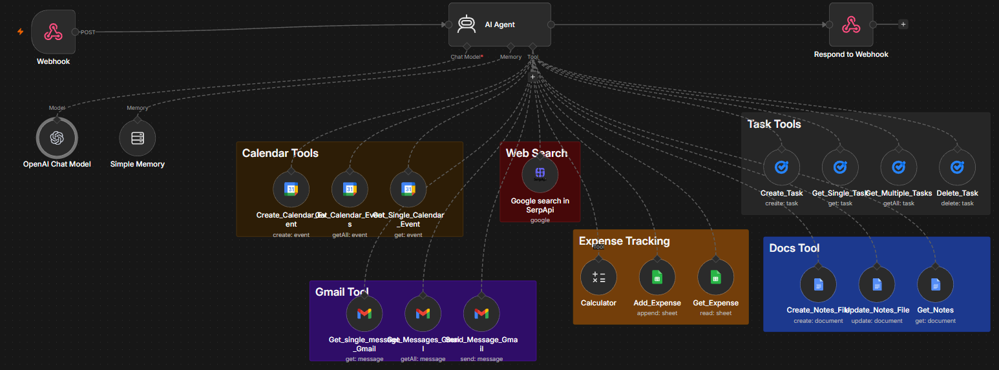

# 🤝 Personal Assistant - n8n + Streamlit

A conversational personal assistant application that combines the power of **n8n workflow automation** with a **Streamlit frontend** to provide an intuitive chatbot interface. The assistant can handle multiple tasks including calendar management, email handling, task management, notes, and expense tracking.

## 🎯 Project Overview

This project demonstrates how to integrate **n8n** (a low-code workflow automation platform) with **Streamlit** (a Python web app framework) to create a functional AI-powered personal assistant.

### Key Features

- **💬 Chat Interface**: Interactive conversation UI powered by Streamlit
- **📅 Calendar Management**: Create and view Google Calendar events
- **📧 Email Handling**: Read, summarize, and reply to emails via Gmail
- **✅ Task Management**: Create and manage tasks via Google Tasks
- **📝 Notes Management**: Create and append notes to Google Docs
- **💰 Expense Tracking**: Add and track expenses using Google Sheets
- **🔍 Information Lookup**: Answer general knowledge questions with optional web search
- **⚡ Scalable Workflow**: Built on n8n for easy customization and extension

## � Workflow Architecture

This diagram shows how all the components work together in the n8n automation workflow:



The workflow is built around a central **AI Agent** that:
- Receives requests through a webhook
- Routes tasks to appropriate tools based on user requests
- Manages conversation memory for context-aware responses
- Returns results back through the webhook to the Streamlit frontend

## �🛠️ Tech Stack

- **Frontend**: [Streamlit](https://streamlit.io/) - Fast Python web framework for data apps
- **Workflow Automation**: [n8n](https://n8n.io/) - Low-code workflow automation platform
- **Language**: Python 3.12+
- **Integration Services**: Google Calendar, Gmail, Google Tasks, Google Docs, Google Sheets

## 📋 Prerequisites

Before running this project, ensure you have:

- Python 3.12 or higher
- `uv` package manager (or pip as alternative)
- An active n8n account with a configured workflow
- Google Cloud credentials for:
  - Google Calendar API
  - Gmail API
  - Google Tasks API
  - Google Docs API
  - Google Sheets API
- Access to the n8n webhook URL

## 🚀 Installation & Setup

### 1. Clone the Repository

```bash
git clone <repository-url>
cd n8n-masterclass-main
```

### 2. Install Dependencies

Using `uv`:
```bash
uv sync
```

### 3. Configure n8n Webhook

Update the webhook URL in `app.py` line 47 with your n8n workflow's webhook endpoint:

```python
response = requests.post(
    "YOUR_N8N_WEBHOOK_URL",
    json={"message": user_message}
)
```

### 4. Set Up Google Credentials

Ensure your n8n workflow has access to Google services by configuring OAuth credentials for:
- Google Calendar
- Gmail
- Google Tasks
- Google Docs
- Google Sheets

## 📖 How to Use

### Running the Application

Start the Streamlit app:

```bash
streamlit run app.py
```

Or with `uv`:
```bash
uv run streamlit run app.py
```

The app will open in your browser at `http://localhost:8501`

### Using the Assistant

1. **View Capabilities**: The app displays a list of what your personal assistant can do
2. **Enter Messages**: Type your request in the chat input box at the bottom
3. **Get Responses**: The assistant processes your message through the n8n workflow and returns results
4. **View History**: All chat messages are stored in session state for conversation context

### Example Commands

- "What's on my calendar for today?"
- "Create a meeting with John tomorrow at 2 PM"
- "Read my emails and give me a summary"
- "Add milk to my shopping list"
- "Create a note about my project ideas"
- "Log an expense of $50 for lunch"

## 📁 Project Structure

```
.
├── app.py              # Main Streamlit application
├── main.py             # Placeholder file for additional logic
├── pyproject.toml      # Project configuration and dependencies
├── sysprompt.md        # System prompt for n8n workflow behavior
└── README.md           # This file
```

## 🔗 n8n Workflow

The n8n workflow (`sysprompt.md`) defines the assistant's behavior and capabilities:

1. **Information & Question Answering**: General knowledge queries with optional web search
2. **Calendar Management**: Create, fetch, and manage Google Calendar events
3. **Email Management**: Read, summarize, and reply to Gmail messages
4. **Task & To-Do Management**: Create and manage tasks via Google Tasks
5. **Notes Management**: Create and append notes in Google Docs
6. **Expense Tracking**: Log and retrieve expenses from Google Sheets

### Tool Integration

The workflow uses specialized tools for each capability:
- `Google_Search` for web queries
- `Create_Calendar_Event`, `Get_Calendar_Events` for calendar management
- `Get_Messages_Gmail`, `Send_Message_Gmail` for email handling
- `Create_Tasks`, `Get_Multiple_Tasks` for task management
- `Create_Notes_File`, `Update_Notes` for notes
- Google Sheets integration for expense tracking

## 💾 Session State

The application maintains a chat history using Streamlit's session state:

```python
st.session_state.messages  # List of {"role": "user"/"assistant", "content": "..."}
```

This allows the assistant to maintain context across messages within a single session.

